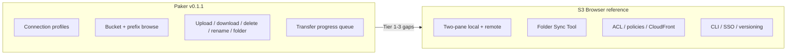
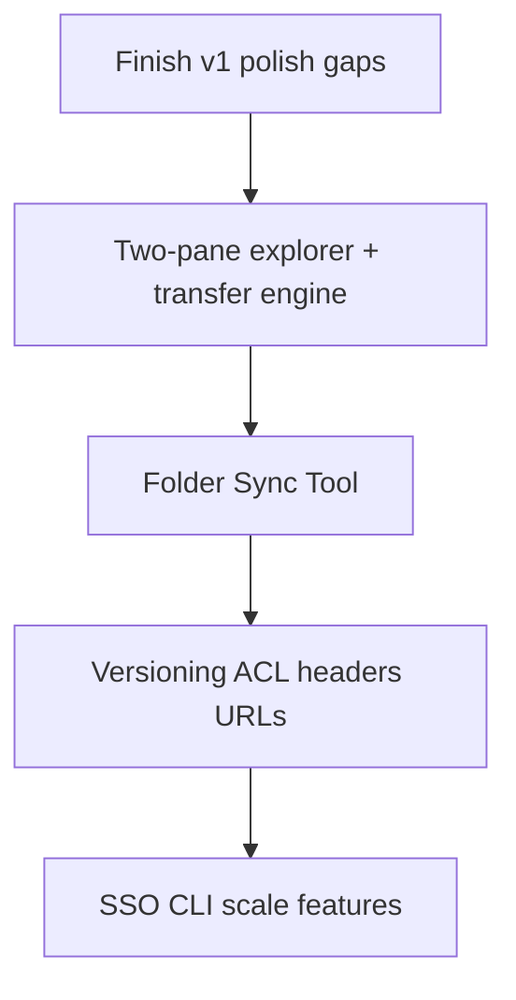

# S3 Browser Feature Parity Roadmap for Paker

## Context

The [prior session](d863a53a-cce4-487f-ae3a-6bca7bd7f62d) built **Paker** — a cross-platform Tauri 2 + React S3 client intended to resemble [S3 Browser](https://s3browser.com/) with a modern UI. The original plan ([s3_desktop_browser_b4faf429.plan.md](/Users/kkopanidis/.cursor/plans/s3_desktop_browser_b4faf429.plan.md)) deliberately scoped v1 to core browsing + file ops and listed many S3 Browser features as out-of-scope.

**Paker today (v0.1.1)** covers the v1 foundation well, plus post-v1 fixes for Windows secret storage and single-bucket IAM keys.

---

## What Paker already has (baseline)

| Area                                              | Status                                                                                                             |
| ------------------------------------------------- | ------------------------------------------------------------------------------------------------------------------ |
| Multi-connection profiles                         | Done — `[src-tauri/src/storage/profiles.rs](src-tauri/src/storage/profiles.rs)`                                    |
| Provider presets (AWS, MinIO, R2, DO, B2, Custom) | Done — `[src/types/connection.ts](src/types/connection.ts)`                                                        |
| Secret storage (keychain + encrypted file)        | Done — `[src-tauri/src/storage/secrets.rs](src-tauri/src/storage/secrets.rs)`                                      |
| Portable mode (`portable.txt` / `PAKER_PORTABLE`) | Done — `[src-tauri/src/storage/paths.rs](src-tauri/src/storage/paths.rs)`                                          |
| Test connection                                   | Done — `[src-tauri/src/commands/connections.rs](src-tauri/src/commands/connections.rs)`                            |
| Single-bucket / restricted IAM keys               | Done — `defaultBucket`, `[BucketPromptDialog](src/components/connections/BucketPromptDialog.tsx)`, `verify_bucket` |
| List objects + folder semantics                   | Done — delimiter `/`, breadcrumbs                                                                                  |
| File table (name, size, modified, storage class)  | Done — `[FileTable.tsx](src/components/browser/FileTable.tsx)`                                                     |
| Multi-select + basic toolbar ops                  | Done — `[BrowserToolbar.tsx](src/components/browser/BrowserToolbar.tsx)`                                           |
| Multipart upload (>5 MB)                          | Done — `[src-tauri/src/s3/operations.rs](src-tauri/src/s3/operations.rs)`                                          |
| Transfer progress events                          | Done — `transfer-progress` + `[TransferQueue](src/components/transfers/TransferQueue.tsx)`                         |
| Dark/light theme, resizable 3-panel layout        | Done — `[AppShell.tsx](src/components/layout/AppShell.tsx)`                                                        |
| Shortcuts F5 / Delete / Ctrl+U                    | Done — `[useKeyboardShortcuts.ts](src/hooks/useKeyboardShortcuts.ts)`                                              |

---

## Known v1 gaps still open (planned but not finished)

These were in the original plan and remain incomplete in the codebase:

| Feature                              | Evidence of gap                                                                   | Key files to extend                                       |
| ------------------------------------ | --------------------------------------------------------------------------------- | --------------------------------------------------------- |
| **Context menus**                    | `[context-menu.tsx](src/components/ui/context-menu.tsx)` exists but is never used | `FileTable`, `BucketSidebar`, `ConnectionList`            |
| **Drag-and-drop upload**             | No `onDrop` / drag handlers anywhere                                              | `AppShell` or file panel                                  |
| **Object details pane**              | Plan listed "optional v1"; not built                                              | New `ObjectDetails` panel + `head_object` command         |
| **List pagination**                  | Backend returns `continuationToken` / `isTruncated`; UI loads one page only       | `[useBrowser.ts](src/hooks/useBrowser.ts)` `loadObjects`  |
| **Folder tree sidebar**              | Plan said "folder tree"; only flat table + breadcrumbs                            | New tree component using prefix listing or lazy children  |
| **Transfer cancel / pause / resume** | Plan Phase 3; queue is display-only                                               | Rust transfer tokens + cancel channel; S3 multipart abort |
| **Delete confirmation**              | No `AlertDialog` / confirm on delete                                              | `AppShell` / `useBrowser`                                 |
| **Session token (STS)**              | Plan v1.1; not in connection model                                                | `ConnectionProfile`, `ConnectionForm`, `build_client`     |
| **Copy / move between buckets**      | Only rename (copy+delete same bucket)                                             | `copy_object` across buckets, multi-select batch          |
| **Recursive folder download/upload** | Single-level ops only                                                             | Walk prefixes locally + batch transfer                    |
| **Bookmarks / favorites**            | Plan out-of-scope v1                                                              | Local JSON store per connection                           |
| **In-app preview**                   | Plan out-of-scope v1                                                              | Image/text viewer + temp download                         |
| **Search / filter file list**        | Not implemented                                                                   | Client filter + optional `ListObjectsV2` prefix search    |

---

## Tier 1 — Practical file-manager parity

*What most users mean when they say "like S3 Browser" for daily work.*

### 1.1 UX polish (close the original v1 plan)

- Wire **right-click context menus** (upload, download, delete, rename, copy path, refresh)
- **Drag-and-drop** from OS file manager into current prefix
- **Delete confirmation** and overwrite prompts on upload
- **Load more / infinite scroll** using existing `continuationToken` in `[list_objects](src-tauri/src/commands/s3_ops.rs)`
- **Enter** opens folder; **Ctrl/Cmd+A** select all; **Ctrl/Cmd+D** download
- Show **ETag / content-type / metadata** in a details drawer when a row is selected (`HeadObject`)

### 1.2 Two-pane explorer (signature S3 Browser layout)

S3 Browser’s defining UX is **local filesystem + remote S3 side-by-side**, not Paker’s current connections → buckets → single remote pane.

- Add a **local file panel** (native dir picker root + tree/list)
- **Dual selection** → upload/download between panes
- **Drag between panes** (local → S3 upload, S3 → local download)
- Remember last local directory per connection

### 1.3 Transfer engine upgrades

S3 Browser highlights: multipart with **pause/resume**, concurrent transfers, bandwidth limits.

| Feature                  | S3 API / approach                                                                 |
| ------------------------ | --------------------------------------------------------------------------------- |
| Concurrent transfers     | Tokio semaphore in Rust; configurable max parallel (free S3 Browser = 3)          |
| Pause / resume multipart | Persist `uploadId` + completed parts; `UploadPart` / `CompleteMultipartUpload`    |
| Cancel in-flight         | `AbortMultipartUpload`; cancel token on downloads                                 |
| Overwrite policies       | Skip / overwrite / rename-if-exists on upload                                     |
| Bandwidth throttle       | Rate-limited byte stream in Rust                                                  |
| Integrity check          | Optional MD5/SHA256 compare after download (S3 Browser "data integrity checking") |

### 1.4 Copy, move, batch ops

- **Copy** objects (same bucket, cross-prefix, cross-bucket, cross-connection)
- **Move** = copy + delete
- **Batch rename** patterns (prefix replace)
- **Multi-object delete** already exists in backend; add progress UI for large batches

### 1.5 Connection ergonomics

- **Session token** field for temporary STS credentials
- **Import/export** connection profiles (JSON; secrets handled separately)
- **Account reordering** (S3 Browser 13.x restored this)
- **Proxy settings** per connection (HTTP proxy in AWS SDK config)
- **Requester Pays** toggle per bucket/connection

---

## Tier 2 — Folder Sync Tool parity

S3 Browser’s **Folder Sync Tool** is a major differentiator ([docs](https://s3browser.com/amazon-s3-folder-sync.aspx)).

### 2.1 Sync job model

- Job definition: source (local path **or** `s3://bucket/prefix`), destination (local **or** S3), direction (one-way mirror)
- Persist jobs in `data/sync-jobs.json`
- Manual run + optional schedule (later)

### 2.2 Compare strategies

- **Size + last-modified** (fast)
- **Hash compare** (local hash vs remote metadata; S3 Browser stores hashes in metadata for remote)
- Options: new only / changed only / both
- **Propagate deletions** toggle

### 2.3 Filters and exclusions

- Include/exclude glob patterns (files and folders)
- Sync exclusion rules (S3 Browser 13.3.5 feature)
- Default HTTP headers on upload during sync

### 2.4 Sync results UI

- Post-run report: added / updated / skipped / failed
- Sorting, image preview, quick actions (S3 Browser 13.3.5)
- Optional local metadata cache file

---

## Tier 3 — AWS storage admin parity

*S3 Browser admin features beyond file management.*

### 3.1 Bucket lifecycle

| Feature                      | S3 APIs                                        |
| ---------------------------- | ---------------------------------------------- |
| Create / delete bucket       | `CreateBucket`, `DeleteBucket`                 |
| Bucket versioning on/off     | `PutBucketVersioning`                          |
| **Version manager** UI       | `ListObjectVersions`, restore, delete version  |
| Incomplete multipart cleanup | `ListMultipartUploads`, `AbortMultipartUpload` |
| Lifecycle rules editor       | `PutBucketLifecycleConfiguration`              |
| Static website hosting       | `PutBucketWebsite`                             |
| Bucket logging               | `PutBucketLogging`                             |
| CORS configuration           | `PutBucketCors`                                |

### 3.2 Permissions and sharing

- **ACL viewer/editor** (object + bucket)
- **Batch ACL assignment**
- **Bucket policy** JSON editor
- **Bucket sharing wizard** (pre-canned policy templates)
- **Object tagging** (view/edit tags)

### 3.2 Storage classes and Glacier

- Change storage class on upload/copy
- **Restore from Glacier / Deep Archive** (`RestoreObject`)
- Cold storage / retention-mode awareness (S3 Browser/TntDrive recent releases)

### 3.3 Encryption and headers

- Server-side encryption options (SSE-S3, SSE-KMS, SSE-C) on upload
- **Client-side AES-256 encryption** before upload (S3 Browser feature)
- **HTTP headers editor** per object; default headers per connection/bucket
- Client-side compression option

### 3.4 URLs and publishing

- **Presigned URL generator** (time-limited GET/PUT; Signature V4)
- **CloudFront manager** (distributions — separate AWS SDK service)
- Copy S3 path / HTTPS URL / `s3://` URI to clipboard

---

## Tier 4 — Auth, automation, and enterprise

### 4.1 Authentication beyond access keys

- **AWS SSO / IAM Identity Center** session profiles (S3 Browser 13.x)
- AWS CLI profile import (`~/.aws/credentials`, `~/.aws/config`)
- IAM role assumption (STS `AssumeRole`)
- OAuth where provider supports it (limited for generic S3-compatible)

### 4.2 CLI / automation

S3 Browser ships a rich **command-line interface** (`/file list-sync-jobs`, `/file run-sync-job`, `/file delete-versions`, etc.).

- Paker CLI subcommand or separate `paker-cli` binary wrapping same Rust S3 layer
- Scriptable: list, upload, download, sync, delete-versions
- Exit codes suitable for CI/cron

### 4.3 Scale and reliability

- **Millions of objects** — virtualized table, background prefix indexing, don't load all keys into memory
- **Regex bucket/object search** across prefixes
- CSV export of object listings
- Error reporting / retry with exponential backoff
- Transfer Acceleration toggle (`UseAccelerateEndpoint`)

---

## Tier 5 — Distribution parity (optional)

S3 Browser is **Windows-only**; Paker’s cross-platform scope is already a differentiator. Remaining distribution gaps vs S3 Browser’s polish:

- Code signing (Windows Authenticode, macOS notarization)
- WebView2 bundling in portable Windows zip (plan noted)
- Auto-update channel
- High-DPI / per-monitor scaling audit (S3 Browser 13.1+ emphasis)

---

## Recommended implementation order

| Phase | Delivers                                                                    | Rough effort                                |
| ----- | --------------------------------------------------------------------------- | ------------------------------------------- |
| **0** | Context menus, DnD, pagination, details pane, delete confirm, session token | Small — mostly frontend + 1-2 Rust commands |
| **1** | Two-pane UI + concurrent/pausable transfers + copy/move                     | Medium — largest UX shift                   |
| **2** | Folder Sync Tool (jobs, compare, filters, report)                           | Large — new subsystem                       |
| **3** | Versioning, ACLs, presigned URLs, Glacier restore, bucket admin             | Large — many S3 APIs                        |
| **4** | SSO, CLI, CloudFront, million-object scale                                  | Very large — multi-month                    |

---

## Parity summary

| Category                             | Paker     | S3 Browser   | Gap severity         |
| ------------------------------------ | --------- | ------------ | -------------------- |
| Connection + S3-compatible endpoints | Strong    | Strong       | Low                  |
| Remote browse + basic ops            | Strong    | Strong       | Low                  |
| Two-pane local+remote                | Missing   | Core         | **High**             |
| Folder sync                          | Missing   | Core         | **High**             |
| Transfer pause/resume/throttle       | Partial   | Strong       | Medium               |
| Context menus / DnD / pagination     | Partial   | Strong       | Medium               |
| Versioning / ACLs / policies         | Missing   | Strong       | Medium (admin users) |
| CloudFront / lifecycle / website     | Missing   | Strong       | Low (niche)          |
| SSO / CLI                            | Missing   | Strong       | Low–Medium           |
| Cross-platform + portable            | **Ahead** | Windows only | Paker advantage      |

**Bottom line:** Paker already matches S3 Browser for **connect → browse → upload/download/delete/rename** on restricted keys. True "feels like S3 Browser" parity is **Tier 1 (two-pane + transfer polish) + Tier 2 (sync)**. Full product parity through Tiers 3–4 is essentially building a full AWS S3 admin console on top of the file manager.

---

## Suggested next step

Start with **Phase 0** (low risk, closes original plan debt), then **Phase 1 two-pane explorer** — that single change delivers the most recognizable S3 Browser UX improvement.