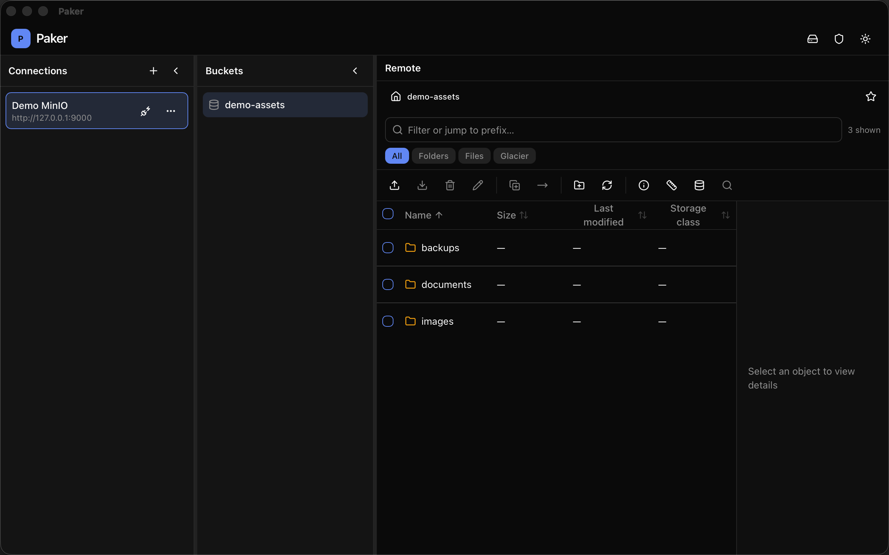
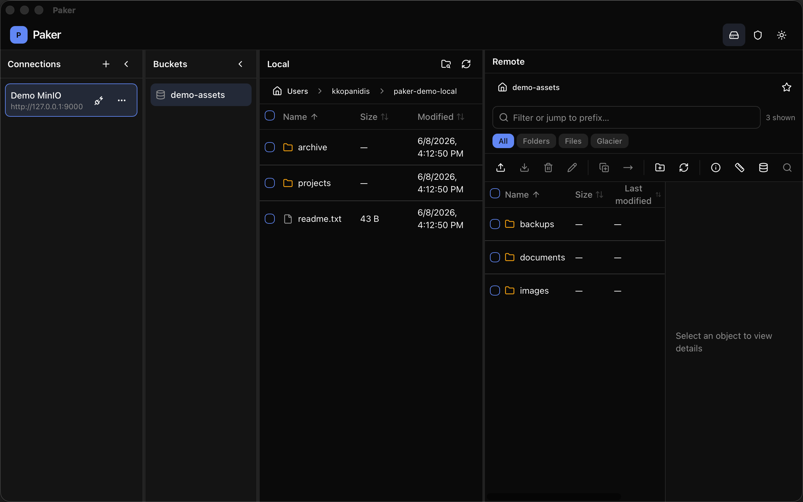

# Paker

[](https://github.com/kkopanidis/paker/actions/workflows/ci.yml)
[](https://opensource.org/licenses/MIT)
[](https://github.com/kkopanidis/paker/releases/latest)

A modern, cross-platform desktop browser for S3-compatible storage. Built with Tauri 2, React, and the Rust AWS SDK.

## Screenshots





## Features

- **Connection profiles** for AWS S3, MinIO, Cloudflare R2, DigitalOcean Spaces, Backblaze B2, and custom endpoints
- **Multi-panel file manager** — connections, buckets, optional local pane, and remote browser
- **Full file operations** — upload, download, delete, rename, create folder, copy/move
- **Client-side filtering** — search by name, type chips (folders, files, glacier), prefix jump
- **Transfer queue** with live progress for uploads and downloads
- **Portable mode** — place `portable.txt` next to the executable (or set `PAKER_PORTABLE=1`) to store all data in a local `./data/` folder
- **No admin install required** — run from any writable directory

## Downloads

Pre-built binaries are available on the [Releases](https://github.com/kkopanidis/paker/releases) page:

| Platform | Artifacts |
|----------|-----------|
| macOS | arm64 and x64 |
| Windows | NSIS installer and portable zip |
| Linux | AppImage |

> **Note:** Releases are unsigned initially. macOS and Windows may show security warnings until code signing is configured.

## Layout (v0.5+)

The main window is a horizontal split of resizable panels:

| Panel | Purpose |
|-------|---------|
| **Connections** | Saved S3 profiles; select one to browse |
| **Buckets** | Buckets for the active connection |
| **Local** (optional) | Local filesystem browser; toggle from the header |
| **Remote** | Object list, toolbar, filter bar, breadcrumbs, and details |

**Remote browser** includes:

- **Breadcrumb** navigation within the current bucket prefix
- **Toolbar** for upload, download, delete, rename, copy/move, new folder, refresh, and bucket tools
- **Filter bar** — text filter, type chips (All / Folders / Files / Glacier), object count, prefix jump (Enter on a path)
- **File table** — sortable columns, infinite scroll via intersection observer, context menus
- **Object details** — metadata for the focused or single-selected item

### Selection model

- **Focus** (highlighted row): single row under the pointer or keyboard; click a row to focus it and clear checkbox selection
- **Checkbox selection**: explicit multi-select for bulk operations (download, delete, copy/move)
- **Select all** (⌘A / Ctrl+A) selects every object currently loaded in the folder

## Requirements

- [Node.js](https://nodejs.org/) 24+
- [Rust](https://rustup.rs/) stable
- Platform WebView (WebKit on macOS, WebView2 on Windows, WebKitGTK on Linux)

## Development

```bash
npm install
npm run tauri dev
```

## Build (portable artifacts)

```bash
npm run tauri build
```

Outputs (under `src-tauri/target/release/bundle/`):

| Platform | Artifact |
|----------|----------|
| macOS | `.app` (zip or tar for portable use) |
| Windows | `.exe` in NSIS or standalone bundle |
| Linux | AppImage |

## Portable usage

1. Copy the built app to any folder (USB drive, Desktop, etc.)
2. Create an empty `portable.txt` file next to the executable
3. Launch — connections and encrypted secrets are stored in `./data/`

Without `portable.txt`, data lives in the OS user data directory and secrets use the system keychain when available.

## Keyboard shortcuts

Shortcuts apply to the remote browser when it is focused and you are not typing in a text field. On Windows and Linux, use **Ctrl** instead of **⌘**.

| Shortcut | Action |
|----------|--------|
| F5 | Refresh object list |
| Del | Delete selected objects |
| ⌘U / Ctrl+U | Upload files |
| ⌘D / Ctrl+D | Download selected objects |
| ⌘A / Ctrl+A | Select all loaded objects |
| Enter | Open focused folder or selected file |
| ⌘F / Ctrl+F | Focus filter bar |
| F2 | Rename selected object |
| ? | Show keyboard shortcuts help |
| ⌘/ / Ctrl+/ | Show keyboard shortcuts help |

## Development note

Paker is built with AI-assisted development tools as part of a human-directed workflow. Product decisions, architecture, security boundaries, testing, release management, and ongoing maintenance are owned by the maintainer.

AI is used as an implementation accelerator, not as a substitute for review or accountability.

## Community

- [Contributing](CONTRIBUTING.md) — how to report issues, propose changes, and run checks before a PR
- [Security](SECURITY.md) — how to report vulnerabilities responsibly

## License

MIT
